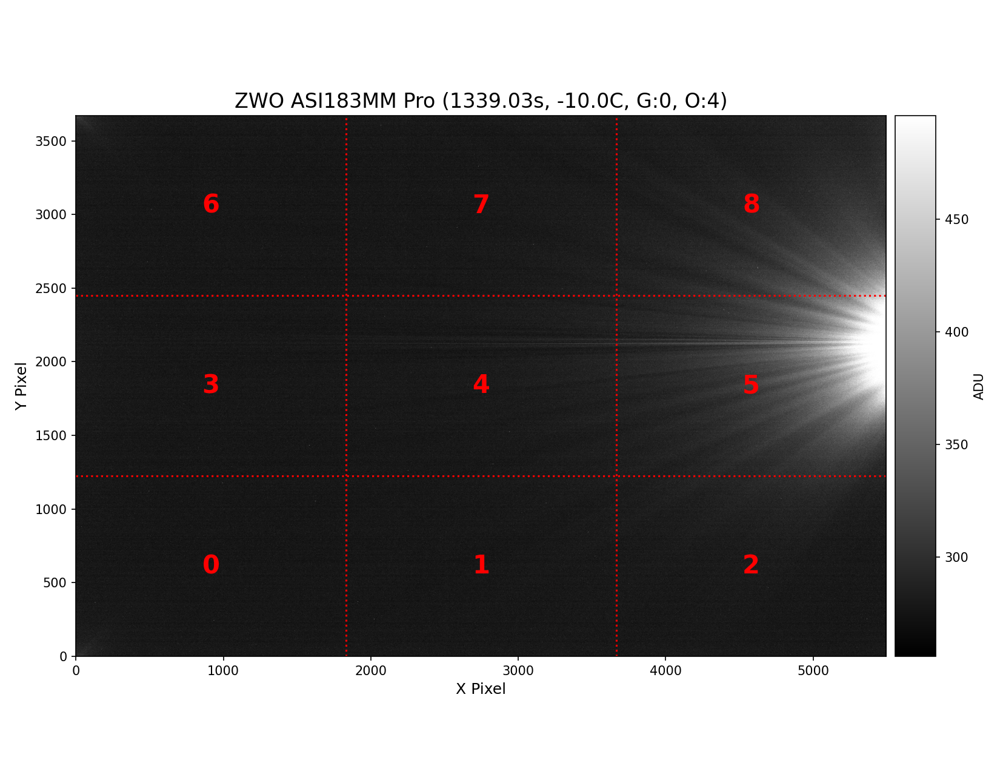
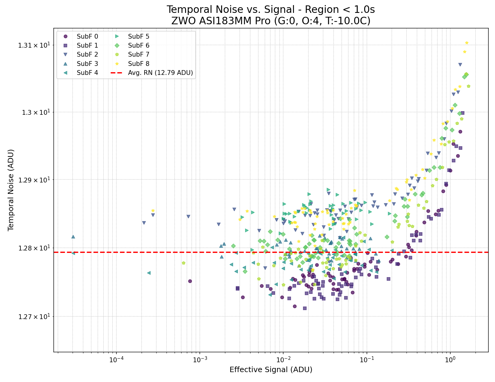
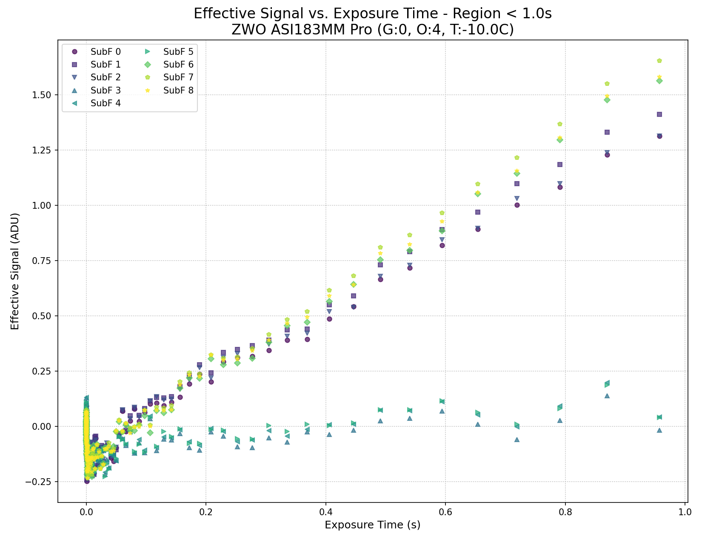
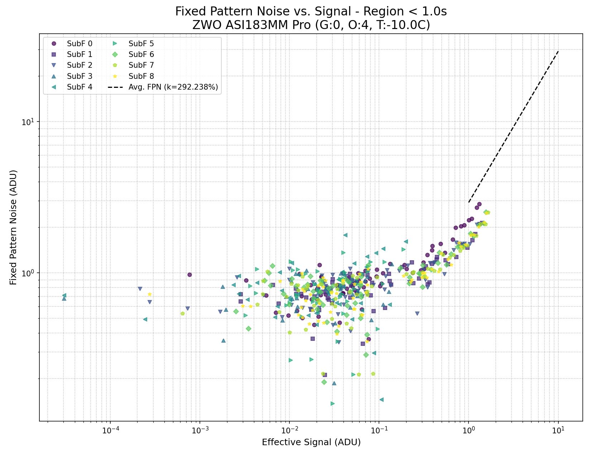
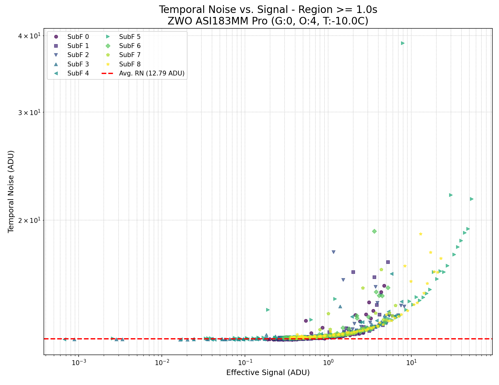
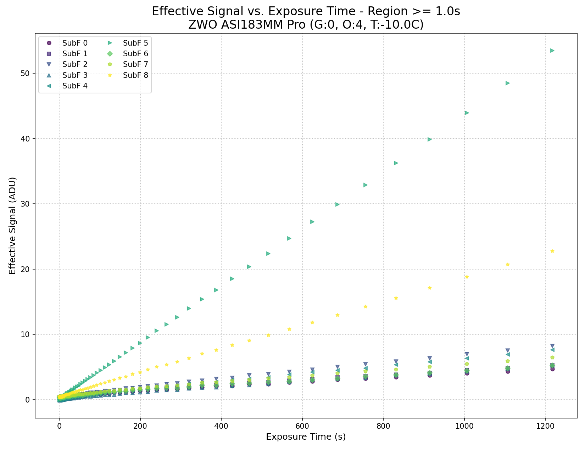
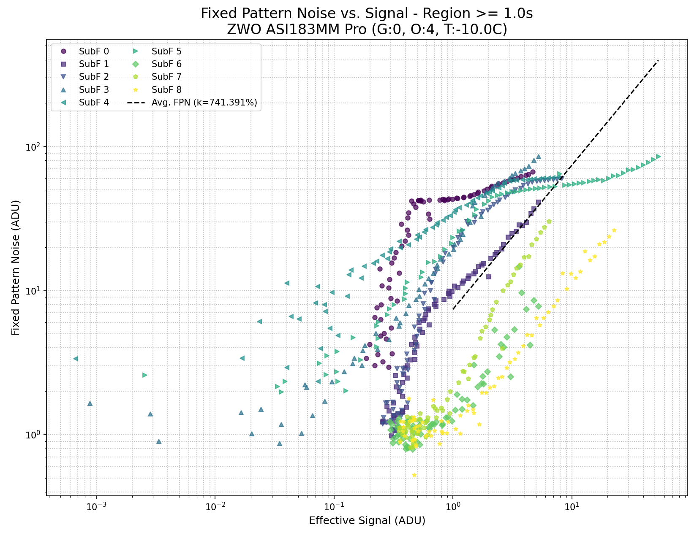

# Dark Current and Noise Analysis Report
- **Date:** 2025-07-03 04:55:08
- **Camera:** `ZWO ASI183MM Pro`
- **Settings:** Temp=`-10.0C`, Gain=`0`, Offset=`4`
- **Analysis Regions:** Region 1 (`<1.0s`), Region 2 (`≥1.0s`)
## Summary Table
| SubF | Bias (ADU) | Read Noise (ADU) | Gain (e-/ADU) <1.0s | Dark Current (e-/s) <1.0s | Gain (e-/ADU) ≥1.0s | Dark Current (e-/s) ≥1.0s | FPN Coeff. (k, %) ≥1.0s |
|:----:|:---:|:---:|:---:|:---:|:---:|:---:|:---:|
| **0** | 272.8 | 12.75 | 0.245 | 0.383 | 0.087 | 0.000 | 1477.7632% |
| **1** | 272.8 | 12.74 | 0.233 | 0.395 | 0.081 | 0.000 | 762.2709% |
| **2** | 273.0 | 12.84 | 0.258 | 0.410 | 0.164 | 0.001 | 862.9532% |
| **3** | 272.8 | 12.79 | nan | nan | 0.183 | 0.001 | 1725.5128% |
| **4** | 272.8 | 12.77 | 0.521 | 0.157 | 0.138 | 0.001 | 922.5165% |
| **5** | 273.1 | 12.85 | nan | nan | 0.207 | 0.009 | 164.0184% |
| **6** | 272.7 | 12.79 | 0.232 | 0.417 | 0.065 | 0.000 | 184.7042% |
| **7** | 272.8 | 12.77 | 0.236 | 0.448 | 0.125 | 0.001 | 456.4757% |
| **8** | 273.2 | 12.83 | 0.243 | 0.443 | 0.152 | 0.003 | 116.3086% |
## Amp Glow Map

---

## Analysis Plots for Region < 1.0s
This set of plots shows the sensor characteristics for very short exposures, governed by one ADC mode.

---

## Analysis Plots for Region ≥ 1.0s
This set of plots shows the sensor characteristics for longer exposures, governed by the second ADC mode.

