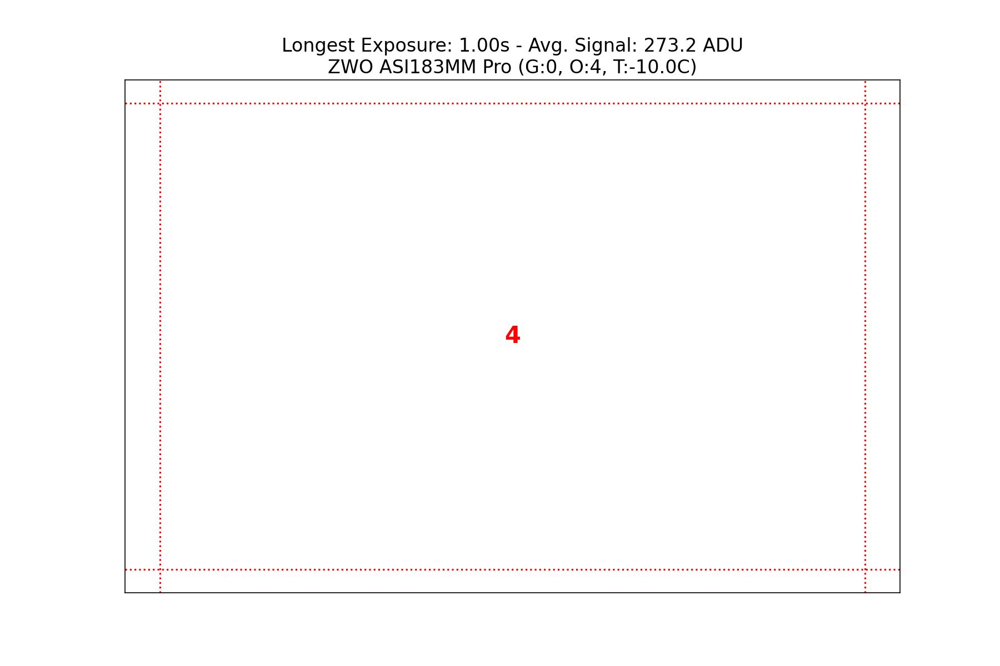
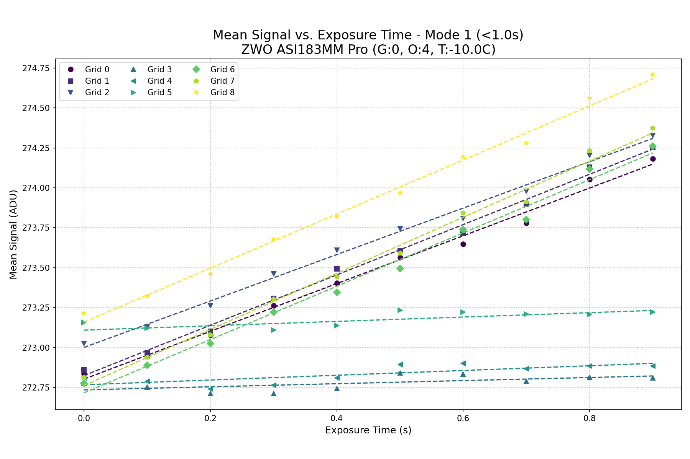
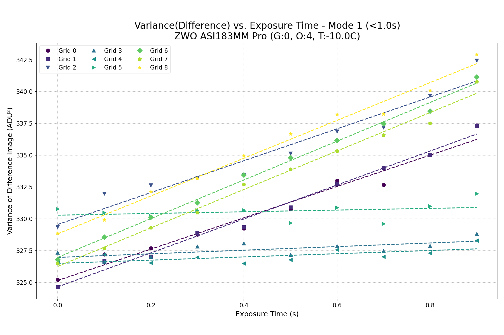
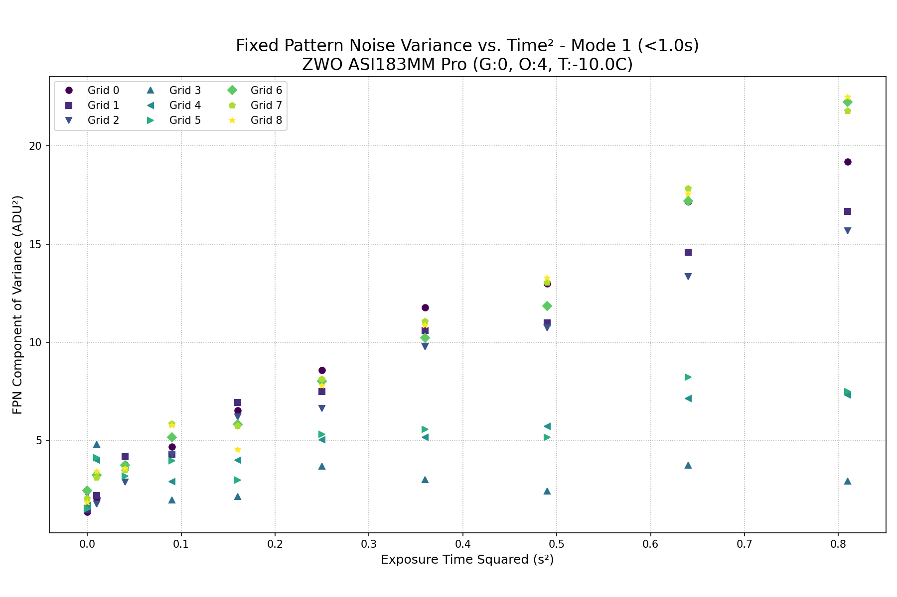

# Dark Frame Characterization Report

- **Date:** 2025-07-03 11:59:10
- **Camera:** `ZWO ASI183MM Pro`
- **Settings:** Temp=`-10.0C`, Gain=`0`, Offset=`4`
- **Analysis Method:** Time-based linear regression with full error propagation.

## Amp Glow Map
This map indicates the general location of analysis grids. The title provides info from the longest exposure pair.

---

## Results for Mode 1 (`<1.0s`)

| Grid | Fixed Bias (ADU) | Read Noise (e-) | Gain (e-/ADU) | Dark Current (e-/pixel/s) | DSNU (e-/pixel/s) |
|:----:|:---:|:---:|:---:|:---:|:---:|
| **0** | `272.80 ± 0.02` | `3.10 ± 0.22` | `0.243 ± 0.018` | `0.3633 ± 0.0285` | `0.5684 ± 0.0431` |
| **1** | `272.82 ± 0.02` | `3.01 ± 0.14` | `0.236 ± 0.011` | `0.3720 ± 0.0197` | `0.5004 ± 0.0279` |
| **2** | `273.00 ± 0.02` | `2.98 ± 0.26` | `0.232 ± 0.021` | `0.3376 ± 0.0315` | `0.4776 ± 0.0440` |
| **3** | `272.74 ± 0.02` | `1.74 ± 1.01` | `0.136 ± 0.079` | `0.0132 ± 0.0097` | `nan ± nan` |
| **4** | `272.77 ± 0.02` | `3.01 ± 1.42` | `0.235 ± 0.111` | `0.0350 ± 0.0194` | `0.2845 ± 0.1358` |
| **5** | `273.11 ± 0.02` | `5.26 ± 6.19` | `0.409 ± 0.482` | `0.0561 ± 0.0682` | `0.5195 ± 0.6131` |
| **6** | `272.72 ± 0.03` | `2.80 ± 0.12` | `0.219 ± 0.010` | `0.3658 ± 0.0204` | `0.5234 ± 0.0256` |
| **7** | `272.76 ± 0.03` | `2.97 ± 0.14` | `0.232 ± 0.011` | `0.4085 ± 0.0230` | `0.5613 ± 0.0280` |
| **8** | `273.16 ± 0.02` | `2.92 ± 0.15` | `0.228 ± 0.011` | `0.3856 ± 0.0220` | `0.5572 ± 0.0306` |

### Diagnostic Plots for Mode 1 (`<1.0s`)

---

## Results for Mode 2 (`>=1.0s`)

No data available for this readout mode.

