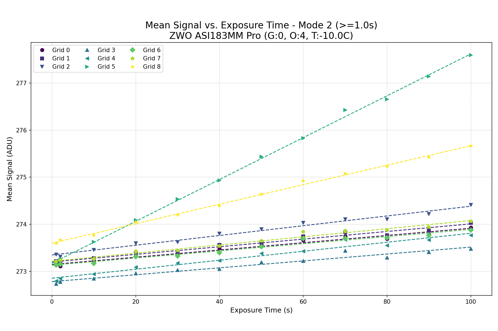
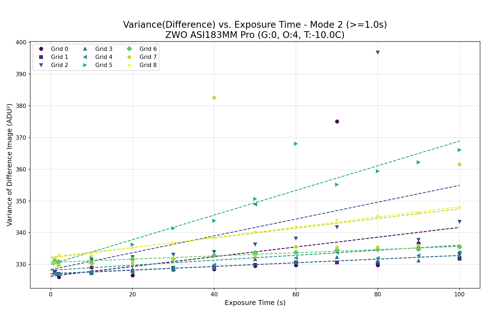
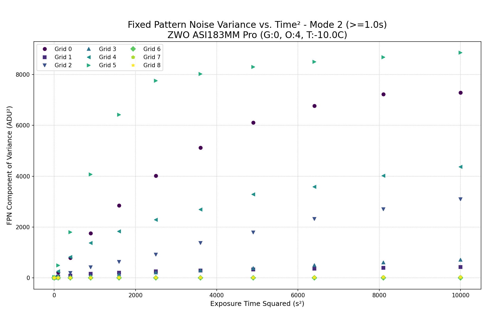

# Dark Frame Characterization Report

- **Date:** 2025-07-03 12:33:06
- **Camera:** `ZWO ASI183MM Pro`
- **Settings:** Temp=`-10.0C`, Gain=`0`, Offset=`4`
- **Analysis Method:** Time-based linear regression with full error propagation.

## Amp Glow Map
This map shows the data from the longest exposure FITS file, visualizing any amp glow and showing the analysis grid locations.

---

## Results for Mode 1 (`<1.0s`)

| Grid | Fixed Bias (ADU) | Read Noise (e-) | Gain (e-/ADU) | Dark Current (e-/pixel/s) | DSNU (e-/pixel/s) |
|:----:|:---:|:---:|:---:|:---:|:---:|
| **0** | `272.80 ± 0.02` | `3.096 ± 0.224` | `0.2428 ± 0.0175` | `0.3633 ± 0.0285` | `0.5684 ± 0.0431` |
| **1** | `272.82 ± 0.02` | `3.007 ± 0.139` | `0.2360 ± 0.0109` | `0.3720 ± 0.0197` | `0.5004 ± 0.0279` |
| **2** | `273.00 ± 0.02` | `2.979 ± 0.265` | `0.2321 ± 0.0206` | `0.3376 ± 0.0315` | `0.4776 ± 0.0440` |
| **3** | `272.74 ± 0.02` | `1.745 ± 1.015` | `0.1364 ± 0.0794` | `0.0132 ± 0.0097` | `nan ± nan` |
| **4** | `272.77 ± 0.02` | `3.005 ± 1.419` | `0.2352 ± 0.1110` | `0.0350 ± 0.0194` | `0.2845 ± 0.1358` |
| **5** | `273.11 ± 0.02` | `5.262 ± 6.191` | `0.4095 ± 0.4818` | `0.0561 ± 0.0682` | `0.5195 ± 0.6131` |
| **6** | `272.72 ± 0.03` | `2.802 ± 0.122` | `0.2192 ± 0.0095` | `0.3658 ± 0.0204` | `0.5234 ± 0.0256` |
| **7** | `272.76 ± 0.03` | `2.969 ± 0.140` | `0.2324 ± 0.0110` | `0.4085 ± 0.0230` | `0.5613 ± 0.0280` |
| **8** | `273.16 ± 0.02` | `2.920 ± 0.146` | `0.2277 ± 0.0114` | `0.3856 ± 0.0220` | `0.5572 ± 0.0306` |
| **Summary** | `272.87 ± 0.17` | `3.087 ± 0.914` | `0.2413 ± 0.0709` | `0.2597 ± 0.1701` | `0.4990 ± 0.0923` |

*Summary row shows Mean ± Standard Deviation of the 9 grid values.*

### Diagnostic Plots for Mode 1 (`<1.0s`)

---

## Results for Mode 2 (`>=1.0s`)

| Grid | Fixed Bias (ADU) | Read Noise (e-) | Gain (e-/ADU) | Dark Current (e-/pixel/s) | DSNU (e-/pixel/s) |
|:----:|:---:|:---:|:---:|:---:|:---:|
| **0** | `273.15 ± 0.02` | `1.278 ± 0.947` | `0.1001 ± 0.0742` | `0.0008 ± 0.0006` | `0.0449 ± 0.0333` |
| **1** | `273.20 ± 0.03` | `3.567 ± 0.586` | `0.2789 ± 0.0459` | `0.0023 ± 0.0004` | `0.0285 ± 0.0050` |
| **2** | `273.35 ± 0.02` | `1.000 ± 0.545` | `0.0780 ± 0.0425` | `0.0008 ± 0.0004` | `0.0221 ± 0.0121` |
| **3** | `272.78 ± 0.03` | `3.284 ± 0.468` | `0.2568 ± 0.0366` | `0.0019 ± 0.0003` | `0.0346 ± 0.0049` |
| **4** | `272.85 ± 0.03` | `3.107 ± 1.954` | `0.2426 ± 0.1525` | `0.0023 ± 0.0015` | `0.0800 ± 0.0505` |
| **5** | `273.17 ± 0.03` | `2.942 ± 0.334` | `0.2290 ± 0.0260` | `0.0102 ± 0.0012` | `0.1078 ± 0.0170` |
| **6** | `273.13 ± 0.02` | `3.902 ± 0.354` | `0.3035 ± 0.0275` | `0.0023 ± 0.0002` | `0.0023 ± 0.0004` |
| **7** | `273.21 ± 0.02` | `1.460 ± 1.337` | `0.1133 ± 0.1037` | `0.0010 ± 0.0009` | `0.0029 ± 0.0027` |
| **8** | `273.60 ± 0.02` | `3.294 ± 0.091` | `0.2557 ± 0.0071` | `0.0053 ± 0.0002` | `0.0056 ± 0.0002` |
| **Summary** | `273.16 ± 0.24` | `2.648 ± 1.092` | `0.2064 ± 0.0851` | `0.0030 ± 0.0030` | `0.0365 ± 0.0364` |

*Summary row shows Mean ± Standard Deviation of the 9 grid values.*

### Diagnostic Plots for Mode 2 (`>=1.0s`)

